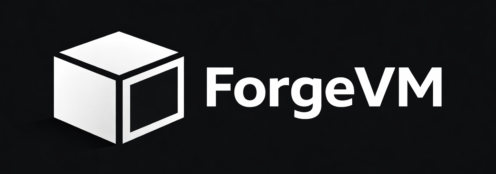
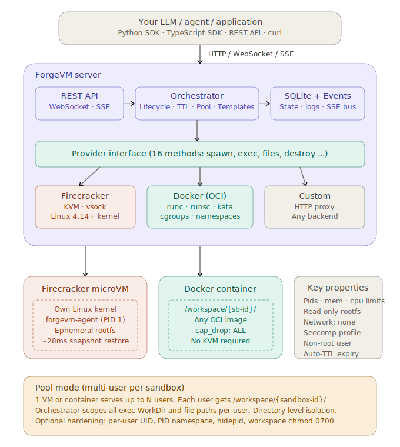

<p align="center">
  
</p>

<p align="center">
  <b>E2B charges per second. You run the computer.</b>
</p>

<p align="center">
  Self-hosted sandbox orchestration for AI agents. Single binary.<br>
  Firecracker microVMs (~28ms boot) or Docker containers (no KVM needed). Python + TypeScript SDKs.
</p>

<p align="center">
  <a href="https://github.com/DohaerisAI/forgevm/releases/latest"></a>
  <a href="https://github.com/DohaerisAI/forgevm/stargazers"></a>
  <a href="https://github.com/DohaerisAI/forgevm/actions/workflows/ci.yml"></a>
  
  
</p>

---

## 30-second demo

```bash
# Install
curl -fsSL https://raw.githubusercontent.com/DohaerisAI/forgevm/main/scripts/install.sh | bash

# Start
forgevm serve

# Spawn → run code → destroy
SB=$(curl -s -X POST localhost:7423/api/v1/sandboxes \
  -H 'Content-Type: application/json' \
  -d '{"image":"python:3.12"}' | jq -r .id)

curl -s -X POST localhost:7423/api/v1/sandboxes/$SB/exec \
  -d '{"command":"python3 -c \"print(2**32)\"}' | jq .stdout
# "4294967296\n"

curl -s -X DELETE localhost:7423/api/v1/sandboxes/$SB
```

---

## Why ForgeVM

|  | **ForgeVM (Firecracker)** | **ForgeVM (Docker)** | **E2B** | **Docker alone** |
|--|:---:|:---:|:---:|:---:|
| Hosting | Self-hosted | Self-hosted | Cloud only | Self-hosted |
| KVM required | Yes | **No** | No (managed) | No |
| Works on macOS/Windows | No | **Yes** | Yes | Yes |
| Works in CI | No | **Yes** | Yes | Yes |
| Isolation level | KVM (hardware) | cgroups + namespaces | Firecracker | cgroups + namespaces |
| Boot time | **~28ms** | <1s | ~500ms | ~1s |
| Pricing | **Free** | **Free** | $0.000075/sec | Free |
| Pool mode (N users / 1 VM) | **Yes** | **Yes** | No | No |
| Python + TypeScript SDKs | **Yes** | **Yes** | Yes | No |
| Data privacy | Your machine | Your machine | Their cloud | Your machine |
| REST API + WebSocket | **Yes** | **Yes** | Yes | No |
| E2B drop-in replacement | **Yes** | **Yes** | — | No |

### The math

Running 10 sandboxes, 8 hours/day, 30 days:

| | Cost |
|--|--|
| **E2B** | 10 × 8h × 30d × $0.27/h ≈ **$648/month** |
| **ForgeVM pool mode** | 10 users → 2 containers → **$0** |

---

## Two providers, one API

ForgeVM ships two execution backends. Same REST API, same SDKs, same config format — swap with one line.

### Firecracker — production, hardware isolation

Real KVM microVMs. Each sandbox gets its own kernel, rootfs, and network namespace. AI-generated code cannot escape to the host — even a kernel exploit only affects that sandbox's guest kernel.

**First spawn:** cold boot ~1s + snapshot creation
**Every spawn after:** restore from snapshot **~28ms**

```yaml
# forgevm.yaml
providers:
  default: "firecracker"
  firecracker:
    enabled: true
```

Requires: Linux + KVM. Run `curl ... | bash` on any bare-metal or nested-virt cloud VM.

### Docker — everywhere, no KVM

OCI containers as sandboxes. Works on macOS, Windows (Docker Desktop), Linux, and every CI provider. Same pool mode, same file API, same SDKs.

```yaml
# forgevm.yaml
providers:
  default: "docker"
  docker:
    enabled: true
    default_image: "python:3.12-slim"
    network_mode: "none"      # air-gapped by default
    read_only_rootfs: false
    memory: "512m"
    cpus: "1"
    dropped_caps: ["ALL"]     # drop all capabilities
```

Isolation is cgroup + namespace based (same as Docker), not hypervisor-level. Use for development, CI, and workloads where full VM isolation isn't required.

---

## Give your LLM a computer

Define one tool. Point it at ForgeVM. Done.

```python
import anthropic, requests

FORGEVM = "http://localhost:7423/api/v1"
sb = requests.post(f"{FORGEVM}/sandboxes", json={"image": "python:3.12"}).json()

tools = [{
    "name": "computer",
    "description": "Execute Python code or shell commands in a sandboxed environment.",
    "input_schema": {
        "type": "object",
        "properties": {
            "code": {"type": "string", "description": "Code to run (Python or shell)"},
            "lang": {"type": "string", "enum": ["python", "shell"], "default": "python"}
        },
        "required": ["code"]
    }
}]

def run_tool(input):
    cmd = f"python3 -c {input['code']!r}" if input.get("lang") != "shell" else input["code"]
    r = requests.post(f"{FORGEVM}/sandboxes/{sb['id']}/exec", json={"command": cmd})
    return r.json()

client = anthropic.Anthropic()
messages = [{"role": "user", "content": "Analyze the first 1000 prime numbers and plot their distribution"}]

while True:
    response = client.messages.create(model="claude-opus-4-5", max_tokens=4096, tools=tools, messages=messages)
    messages.append({"role": "assistant", "content": response.content})

    if response.stop_reason == "tool_use":
        results = []
        for block in response.content:
            if block.type == "tool_use":
                output = run_tool(block.input)
                results.append({"type": "tool_result", "tool_use_id": block.id, "content": str(output)})
        messages.append({"role": "user", "content": results})
    else:
        print(next(b.text for b in response.content if hasattr(b, "text")))
        break

requests.delete(f"{FORGEVM}/sandboxes/{sb['id']}")
```

Works with OpenAI, Anthropic, or any model that supports tool/function calling. Each conversation gets its own sandbox. Destroy it when the conversation ends.

---

## Multi-user pool mode

One VM. Many users. Each isolated in their own workspace directory.

```
                    ┌─────────────────────────────┐
   User A ──────────► /workspace/sb-a1b2c3d4/     │
   User B ──────────► /workspace/sb-b9e8f7c6/     │  VM-1 (2GB RAM, 2 vCPU)
   User C ──────────► /workspace/sb-c3d4e5f6/     │
                    └─────────────────────────────┘
                    ┌─────────────────────────────┐
   User D ──────────► /workspace/sb-d1e2f3a4/     │
   User E ──────────► /workspace/sb-e5f6a7b8/     │  VM-2 (2GB RAM, 2 vCPU)
                    └─────────────────────────────┘

   10 users. 2 VMs. Directory-level isolation. Files are invisible across users.
```

```yaml
# forgevm.yaml
pool:
  enabled: true
  max_vms: 10
  max_users_per_vm: 5
  image: "python:3.12"
  memory_mb: 2048
  vcpus: 2
  overflow: "reject"   # or "queue"
```

```bash
curl -s localhost:7423/api/v1/pool/status | jq
# { "total_vms": 2, "active_users": 5, "available_slots": 5 }
```

Works with both Firecracker and Docker providers. With Firecracker, VMs are pre-warmed from snapshots — users get assigned in ~28ms. With Docker, containers spin up in under a second.

---

## Python SDK

```bash
pip install forgevm
```

```python
from forgevm import Client

client = Client("http://localhost:7423")

# Lifecycle
sb = client.spawn(image="python:3.12", memory_mb=1024, vcpus=1)
result = sb.exec("python3 -c 'print(\"hello\")'")
print(result.stdout)   # hello

# Files
sb.write_file("/app/main.py", 'print("built with ForgeVM")')
sb.exec("python3 /app/main.py")
content = sb.read_file("/app/main.py")
files   = sb.list_files("/app")
sb.move_file("/app/main.py", "/app/app.py")
sb.chmod_file("/app/app.py", "755")
info    = sb.stat_file("/app/app.py")
matches = sb.glob_files("/app/*.py")
sb.delete_file("/app/app.py")

# Streaming
for chunk in sb.exec_stream("for i in $(seq 5); do echo line $i; sleep 0.1; done"):
    print(chunk.data, end="", flush=True)

# TTL + cleanup
sb.extend_ttl("30m")
sb.destroy()
```

**Context manager** — auto-destroys:

```python
with client.spawn(image="python:3.12") as sb:
    sb.exec("pip install httpx -q")
    result = sb.exec("python3 -c 'import httpx; print(httpx.get(\"https://httpbin.org/ip\").text)'")
    print(result.stdout)
# sandbox destroyed automatically
```

**Async:**

```python
from forgevm import AsyncClient
import asyncio

async def main():
    async with AsyncClient("http://localhost:7423") as client:
        sb = await client.spawn(image="python:3.12")
        result = await sb.exec("python3 -c 'print(42)'")
        await sb.destroy()

asyncio.run(main())
```

---

## TypeScript SDK

```bash
npm install forgevm
```

```typescript
import { Client } from "forgevm";

const client = new Client("http://localhost:7423");
const sb = await client.spawn({ image: "node:22" });

const result = await sb.exec("node -e 'console.log(process.version)'");
console.log(result.stdout);

// Files
await sb.writeFile("/app/index.js", 'console.log("hello from ForgeVM")');
await sb.exec("node /app/index.js");
const content = await sb.readFile("/app/index.js");
const files   = await sb.listFiles("/app");
await sb.moveFile("/app/index.js", "/app/app.js");
await sb.chmodFile("/app/app.js", "755");
const info    = await sb.statFile("/app/app.js");
const matches = await sb.globFiles("/app/*.js");
await sb.deleteFile("/app/app.js");

// Streaming
for await (const chunk of sb.execStream("ping -c 3 localhost")) {
  process.stdout.write(chunk.data);
}

await sb.extendTtl("30m");
await sb.destroy();
```

---

## Install

### Pre-built binaries (recommended)

```bash
curl -fsSL https://raw.githubusercontent.com/DohaerisAI/forgevm/main/scripts/install.sh | bash
```

Downloads `forgevm` + `forgevm-agent`, installs Firecracker, downloads the Linux kernel. No Go required. KVM access is needed for Firecracker — if your machine doesn't have KVM, use the Docker provider instead.

### Build from source

```bash
git clone https://github.com/DohaerisAI/forgevm && cd forgevm
./scripts/setup.sh
```

Requires Go 1.25+, Docker (for image builds), and KVM. Sets up XFS reflink for the fastest possible snapshot restores.

### Docker only (no KVM, no Firecracker)

If you just want Docker provider (macOS, Windows, CI):

```bash
curl -fsSL .../install.sh | bash   # installs forgevm binary only
forgevm serve                       # starts with Docker provider
```

---

## Configuration

```yaml
# forgevm.yaml — all defaults shown

server:
  host: "0.0.0.0"
  port: 7423

providers:
  default: "firecracker"    # "firecracker" | "docker" | "mock" | "e2b" | "custom"

  firecracker:
    enabled: true
    firecracker_path: "/usr/local/bin/firecracker"
    kernel_path:      "/var/lib/forgevm/vmlinux.bin"
    agent_path:       "./bin/forgevm-agent"
    data_dir:         "/var/lib/forgevm"

  docker:
    enabled: false
    socket:          "unix:///var/run/docker.sock"
    runtime:         "runc"            # "runc" | "runsc" (gVisor) | "kata-runtime"
    default_image:   "alpine:latest"
    network_mode:    "none"
    read_only_rootfs: true
    memory:          "512m"
    cpus:            "1"
    pids_limit:      256
    dropped_caps:    ["ALL"]

defaults:
  ttl:         "30m"
  image:       "alpine:latest"
  memory_mb:   1024
  vcpus:       1

pool:
  enabled:         false
  max_vms:         10
  max_users_per_vm: 5
  image:           "python:3.12"
  memory_mb:       2048
  vcpus:           2
  overflow:        "reject"   # "reject" | "queue"

auth:
  enabled: false
  api_key: ""

logging:
  level:  "info"
  format: "json"   # "json" | "pretty"
```

Config priority: `./forgevm.yaml` → `~/.forgevm/config.yaml` → env vars (`FORGEVM_SERVER_PORT=8080`)

---

## REST API

`http://localhost:7423/api/v1`

### Sandboxes

| Method | Endpoint | Description |
|--------|----------|-------------|
| `POST` | `/sandboxes` | Spawn a sandbox |
| `GET` | `/sandboxes` | List all sandboxes |
| `DELETE` | `/sandboxes` | Prune expired |
| `GET` | `/sandboxes/:id` | Get sandbox |
| `DELETE` | `/sandboxes/:id` | Destroy |
| `POST` | `/sandboxes/:id/extend` | Extend TTL |
| `POST` | `/sandboxes/:id/exec` | Execute command |
| `GET` | `/sandboxes/:id/exec/ws` | Execute via WebSocket |
| `POST` | `/sandboxes/:id/files` | Write file |
| `GET` | `/sandboxes/:id/files` | Read file |
| `DELETE` | `/sandboxes/:id/files` | Delete file |
| `GET` | `/sandboxes/:id/files/list` | List directory |
| `POST` | `/sandboxes/:id/files/move` | Move / rename |
| `POST` | `/sandboxes/:id/files/chmod` | Change permissions |
| `GET` | `/sandboxes/:id/files/stat` | File info |
| `GET` | `/sandboxes/:id/files/glob` | Glob pattern |
| `GET` | `/sandboxes/:id/logs` | Console output |

### Templates · Providers · Environments · System

| Method | Endpoint | Description |
|--------|----------|-------------|
| `POST/GET` | `/templates` | Sandbox templates |
| `POST` | `/templates/:name/spawn` | Spawn from template |
| `GET` | `/providers` | List registered providers |
| `POST` | `/providers/test` | Health-check a provider |
| `POST/GET` | `/environments/specs` | Environment specs |
| `POST/GET` | `/environments/builds` | Image builds |
| `POST` | `/environments/registry-connections` | Registry credentials |
| `GET` | `/health` | Health check |
| `GET` | `/metrics` | Runtime metrics |
| `GET` | `/events` | SSE event stream |
| `GET` | `/pool/status` | Pool status |

---

## Architecture



---

## Security

### Firecracker: hardware-level isolation

Each sandbox runs its own Linux kernel inside a KVM virtual machine. AI-generated code that exploits a kernel vulnerability only compromises that sandbox's kernel — the host is untouched. The guest agent communicates with the host over `virtio-vsock` only. No network exposure, no shared kernel.

- Each sandbox = dedicated kernel + ephemeral rootfs
- vsock only — zero host network exposure
- Auto-TTL — sandbox destroyed after timeout
- Optional API key authentication

### Docker: defense-in-depth

Docker sandboxes use `cap_drop: ALL`, `network_mode: none`, `read_only_rootfs`, PID limits, and seccomp profiles by default. Not hardware-isolated like Firecracker, but appropriate for trusted workloads, development, and CI environments.

Switching runtimes is one config line:

```yaml
docker:
  runtime: "runsc"       # gVisor — syscall interception, stronger isolation
  # runtime: "kata-runtime"  # Kata containers — VM-backed OCI
```

### When to use which

| Workload | Provider |
|----------|----------|
| Untrusted user code in production | Firecracker |
| Internal tooling, developer sandboxes | Docker |
| macOS / Windows / CI | Docker (only option without KVM) |
| Maximum throughput on Linux servers | Firecracker (snapshot restore) |

---

## CLI

```bash
forgevm serve                              # start server
forgevm spawn --image python:3.12 --ttl 1h # spawn interactively
forgevm list                               # list all sandboxes
forgevm exec sb-a1b2c3d4 -- echo hello    # run a command
forgevm kill sb-a1b2c3d4                  # destroy
forgevm build-image python:3.12           # prebake Docker image → Firecracker rootfs
forgevm tui                               # interactive dashboard
forgevm version                           # print version
```

---

## Development

```bash
make build          # build server binary
make build-agent    # build guest agent (static linux/amd64)
make build-all      # build both
make test           # go test ./...
make web            # build React dashboard
make lint           # go vet
make release-build  # static binaries + checksums.txt
```

## Contributing

[CONTRIBUTING.md](CONTRIBUTING.md)

## License

[MIT](LICENSE)
